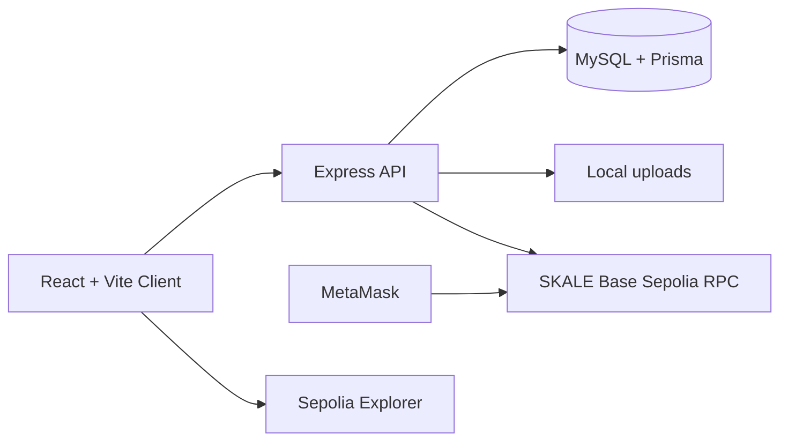

# MediChain

Blockchain-Based Lifelong Digital Health Record System.

MediChain is a university/demo healthcare coordination platform with patient-controlled consent, appointments, hospital-managed care cases, doctor sessions, diagnostic laboratory handoffs, secure local file uploads, SHA-256 document hashing, MySQL operational data, and SKALE Base Sepolia proof anchoring.

> Stored securely off-chain; integrity and ownership proof anchored on blockchain.

## Features

- Patient, doctor, hospital, laboratory, and admin roles.
- JWT authentication with bcrypt password hashing.
- Patient Health IDs like `MCH-2026-000001`.
- Consent requests, approvals, limited categories, expiry, and revocation.
- Patient appointment booking with problem details, preferred providers, and previous document uploads.
- Hospital appointment queues, explicit doctor staff rosters, and patient-to-doctor assignment.
- Doctor care sessions, consultations, prescriptions, diagnostic orders, follow-ups, and case completion.
- Hospital-to-laboratory test assignment with completed report delivery to patients and doctors.
- Prescriptions, consultations, hospital records, diagnostic report uploads, and audit logs.
- Local file storage under `server/uploads/`, with authenticated download routes only.
- Solidity proof contract on SKALE Base Sepolia for record hashes, access proofs, and emergency events.
- Responsive healthcare dashboard with MetaMask-signed SKALE Base Sepolia transactions.

## Architecture



Files and readable health data stay off-chain. Only hashes, pseudonymous identifiers, timestamps, permission metadata hashes, and transaction metadata are stored on chain.

## Setup

```bash
npm install
docker compose up -d
cp server/.env.example server/.env
cp client/.env.example client/.env
cp contracts/.env.example contracts/.env
npm run db:migrate
npm run db:seed
npm run contract:compile
npm run contract:test
npm run dev
```

Frontend: `http://localhost:5173`  
Backend: `http://localhost:5000`

## Required Environment Values

Fill these manually before real SKALE Base Sepolia anchoring:

- `server/.env`: `DATABASE_URL`, `JWT_SECRET`, `JWT_REFRESH_SECRET`, `RPC_URL`, `BLOCKCHAIN_PRIVATE_KEY`, `CONTRACT_ADDRESS`
- `client/.env`: `VITE_API_BASE_URL`, `VITE_CHAIN_ID`, `VITE_CONTRACT_ADDRESS`, `VITE_SEPOLIA_EXPLORER_BASE_URL`
- `contracts/.env`: `SKALE_BASE_SEPOLIA_RPC_URL`, `DEPLOYER_PRIVATE_KEY`

Never commit real `.env` files or private keys.

## Demo Accounts

| Role | Email | Password |
| --- | --- | --- |
| Admin | `admin@medichain.demo` | `Admin@12345` |
| Patient | `patient@medichain.demo` | `Patient@12345` |
| Doctor | `doctor@medichain.demo` | `Doctor@12345` |
| Hospital | `hospital@medichain.demo` | `Hospital@12345` |
| Laboratory | `lab@medichain.demo` | `Lab@12345` |

## SKALE Base Sepolia Deployment

```bash
cp contracts/.env.example contracts/.env
npm run contract:deploy:skale
```

Deployment output is saved to `contracts/deployments/skaleBaseSepolia.json`. Copy the deployed contract address into:

- `server/.env` as `CONTRACT_ADDRESS`
- `client/.env` as `VITE_CONTRACT_ADDRESS`

Record creators submit proof transactions in MetaMask. After confirmation, the backend independently validates the transaction receipt and exact `RecordRegistered` event before updating database status. The connected wallet must have `PROVIDER_ROLE` (or `SYSTEM_ADMIN_ROLE`) on the deployed contract.

## Commands

```bash
npm run dev
npm run build
npm run test
npm run db:migrate
npm run db:seed
npm run contract:compile
npm run contract:test
npm run contract:deploy:skale
```

## Document Verification

1. A provider uploads or creates a record.
2. The backend stores the file locally if present.
3. The backend computes a SHA-256 hash from file bytes or canonical JSON.
4. The backend computes a metadata hash.
5. MetaMask asks the record creator to confirm `registerRecord` on the smart contract.
6. The backend validates the mined receipt, contract address, and event values before saving the transaction hash and block number in MySQL.
7. Verification recalculates the local hash and compares it with the database and on-chain proof.

## Coordinated Care Workflow

1. A patient books an appointment, describes the problem, chooses a verified hospital and optional preferred doctor, and uploads previous documents.
2. The hospital reviews the appointment and assigns a verified doctor.
3. The doctor requests access; the patient approves the clinical categories and duration.
4. The doctor starts the session, reviews the consent-scoped patient workspace, and records consultations or prescriptions.
5. Diagnostic orders go to the hospital, which assigns a verified laboratory.
6. The laboratory performs the test and uploads the report. The patient and assigned doctor are notified, and the laboratory confirms the report proof through MetaMask.
7. The doctor reviews completed reports, schedules follow-ups, and closes the care case only after outstanding tests are resolved.

### Hospital Staff Roster

Doctor membership is explicit and is not inferred from a free-text organization name. A hospital opens **Staff Doctors**, reviews verified active doctors, and adds them to its roster. Only rostered doctors appear in that hospital's appointment assignment list. Removing a doctor from the roster prevents new assignments but preserves historical care records.

## Known Limitations

- Demo use only.
- Local file storage is used for development.
- Not production-ready medical software.
- Not HIPAA-certified.
- No real emergency healthcare guarantee.
- Seeded blockchain records remain "Demo / pending deployment" until a SKALE Base Sepolia contract and authorized wallet are configured.

## Troubleshooting

- If Prisma cannot connect, run `docker compose up -d` and verify `DATABASE_URL`.
- The bundled Docker MySQL is exposed on host port `3308` to avoid conflicting with a locally installed MySQL service.
- If blockchain status stays pending, fill `RPC_URL`, `BLOCKCHAIN_PRIVATE_KEY`, and `CONTRACT_ADDRESS`.
- If MetaMask reports the wrong network, switch to SKALE Base Sepolia (chain ID `324705682`).
- If uploads fail, verify file type is PDF, PNG, JPG, or JPEG and under 10 MB.
