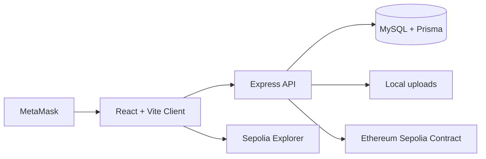

# MediChain

Blockchain-Based Lifelong Digital Health Record System.

MediChain is a university/demo healthcare-record platform with patient-controlled access, role dashboards, local secure file uploads, SHA-256 document hashing, MySQL operational data, and Ethereum Sepolia proof anchoring.

> Stored securely off-chain; integrity and ownership proof anchored on blockchain.

## Features

- Patient, doctor, hospital, laboratory, and admin roles.
- JWT authentication with bcrypt password hashing.
- Patient Health IDs like `MCH-2026-000001`.
- Consent requests, approvals, limited categories, expiry, and revocation.
- Prescriptions, consultations, hospital records, diagnostic report uploads, and audit logs.
- Local file storage under `server/uploads/`, with authenticated download routes only.
- Solidity proof contract on Sepolia for record hashes, access proofs, and emergency events.
- Premium white healthcare UI with responsive dashboards and MetaMask Sepolia validation.

## Architecture



Files and readable health data stay off-chain. Only hashes, pseudonymous identifiers, timestamps, permission metadata hashes, and transaction metadata are stored on chain.

## Setup

```bash
npm install
docker compose up -d
cp server/.env.example server/.env
cp client/.env.example client/.env
cp contracts/.env.example contracts/.env
npm run db:migrate
npm run db:seed
npm run contract:compile
npm run contract:test
npm run dev
```

Frontend: `http://localhost:5173`  
Backend: `http://localhost:5000`

## Required Environment Values

Fill these manually before real Sepolia anchoring:

- `server/.env`: `DATABASE_URL`, `JWT_SECRET`, `JWT_REFRESH_SECRET`, `RPC_URL`, `BLOCKCHAIN_PRIVATE_KEY`, `CONTRACT_ADDRESS`
- `client/.env`: `VITE_API_BASE_URL`, `VITE_CHAIN_ID`, `VITE_CONTRACT_ADDRESS`, `VITE_SEPOLIA_EXPLORER_BASE_URL`
- `contracts/.env`: `SEPOLIA_RPC_URL`, `DEPLOYER_PRIVATE_KEY`, optional `ETHERSCAN_API_KEY`

Never commit real `.env` files or private keys.

## Demo Accounts

| Role | Email | Password |
| --- | --- | --- |
| Admin | `admin@medichain.demo` | `Admin@12345` |
| Patient | `patient@medichain.demo` | `Patient@12345` |
| Doctor | `doctor@medichain.demo` | `Doctor@12345` |
| Hospital | `hospital@medichain.demo` | `Hospital@12345` |
| Laboratory | `lab@medichain.demo` | `Lab@12345` |

## Sepolia Deployment

```bash
cp contracts/.env.example contracts/.env
npm run contract:deploy:sepolia
```

Deployment output is saved to `contracts/deployments/sepolia.json`. Copy the deployed contract address into:

- `server/.env` as `CONTRACT_ADDRESS`
- `client/.env` as `VITE_CONTRACT_ADDRESS`

The backend service wallet submits approved proof transactions. The frontend never receives private keys.

## Commands

```bash
npm run dev
npm run build
npm run test
npm run db:migrate
npm run db:seed
npm run contract:compile
npm run contract:test
npm run contract:deploy:sepolia
```

## Document Verification

1. A provider uploads or creates a record.
2. The backend stores the file locally if present.
3. The backend computes a SHA-256 hash from file bytes or canonical JSON.
4. The backend computes a metadata hash.
5. The backend calls `registerRecord` on the smart contract.
6. The transaction hash, block number, and status are saved in MySQL.
7. Verification recalculates the local hash and compares it with the database and on-chain proof.

## Known Limitations

- Demo use only.
- Local file storage is used for development.
- Not production-ready medical software.
- Not HIPAA-certified.
- No real emergency healthcare guarantee.
- Seeded blockchain records remain “Demo / pending deployment” until a Sepolia contract and funded service wallet are configured.

## Troubleshooting

- If Prisma cannot connect, run `docker compose up -d` and verify `DATABASE_URL`.
- If blockchain status stays pending, fill `RPC_URL`, `BLOCKCHAIN_PRIVATE_KEY`, and `CONTRACT_ADDRESS`.
- If MetaMask reports the wrong network, switch to Ethereum Sepolia.
- If uploads fail, verify file type is PDF, PNG, JPG, or JPEG and under 10 MB.
